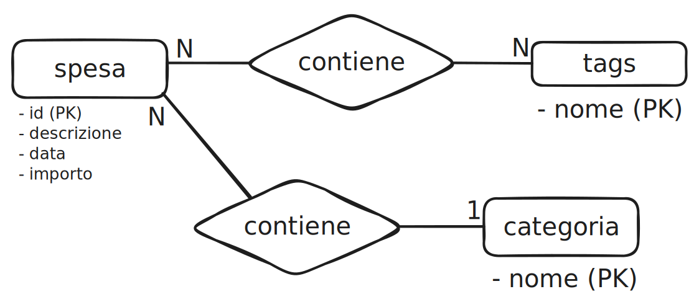

# Spese DB

## Analisi concettuale

Si vuole realizzare un **database** per gestire le spese personali.

Ogni spesa ha una **categoria** e può avere più **tags**.

La spesa contiene diverse informazioni:
- id della spesa
- descrizione
- importo
- data

La categoria e i tags contengono solo un **nome** che li identifica univocamente.

## Diagramma E/R

## Diagramma logico
spese(id [PK], descrizione, data, importo, nome_categoria [FK])
 
tags(nome [PK])
 
categorie(nome [PK])
 
spese_tags(id_spesa [FK], nome_tag [FK], id_spesa+nome_tag [PK])